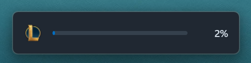

  

<h1 align="center">Voolime</h1>

  <strong>Tiny per-app volume control for Windows.</strong>

  Hold a modifier, press your volume keys, and adjust the app you are using.

## Tiny Trick, Big Relief

Windows volume keys are global. Voolime makes them app-aware.

## Features

- 🍋 Tiny. Built to stay small.
- 🪟 Native. Feels like Windows 11.
- ⌨️ Keyboard and mouse. Use keys or scroll.
- 🎚️ Precise. Tap gently, hold to move fast.
- ⚡ Simple. Right-click the tray icon for options.
- 💡 Try it. Hold `Shift` and press `Volume Up`.

## Preview

## Note

Windows prevents normal apps from inspecting or hooking some elevated windows. If you want modifier+volume controls to work while an elevated app or game is focused, run Voolime elevated too.
