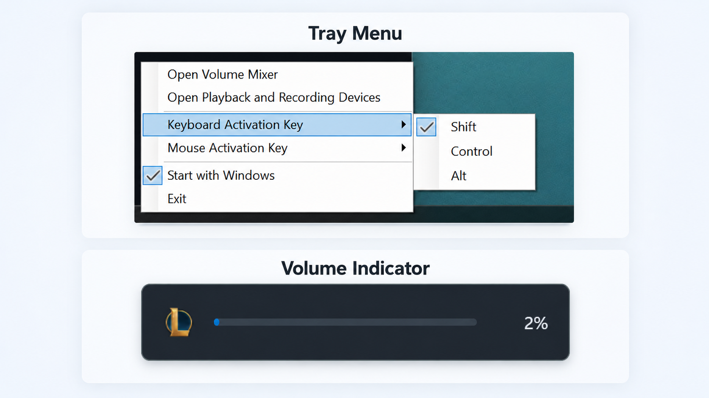

<p align="center">
  
</p>

<h1 align="center">Voolime</h1>

<p align="center">
  <strong>Tiny per-app volume control for Windows.</strong>
</p>

<p align="center">
  Hold a modifier, press your volume keys, and adjust the app you are using.
</p>

## Tiny Trick, Big Relief

Windows volume keys are global. Voolime makes them app-aware.

## Features

- 🍋 Tiny. Built to stay small.
- 🪟 Native. Feels like Windows 11.
- ⌨️ Keyboard and mouse. Press `Shift + Volume Up`.
- 🔑 Application keys. Hold an optional letter, number, or punctuation key to control a specific app even while another app is active.

Open `Application Keys...` from the tray menu to review open and recently audible apps. Voolime suggests collision-free keys for apps with audio sessions, but keeps every suggestion disabled until you opt in.

## How It Looks



## Portable releases and WinKit

Release packages are self-contained: no separate .NET installation is required.
`--background` starts the tray utility without opening a window. A named mutex
prevents duplicate instances. The `winkit.json` release manifest describes portable
packages and their SHA-256 checksums for WinKit. In managed mode, WinKit owns
startup and updates; the independent startup toggle is disabled.

Build release assets with:

```powershell
./scripts/publish-portable.ps1 -AppName Voolime -ProjectPath Voolime.csproj -Version v0.7.0
```

## Note

Windows prevents normal apps from inspecting or hooking some elevated windows. If you want modifier+volume controls to work while an elevated app or game is focused, run Voolime elevated too.
